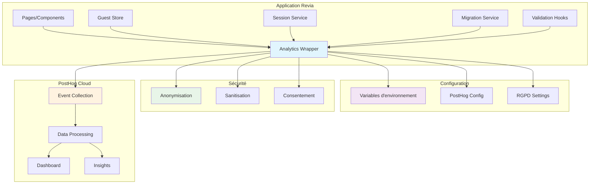
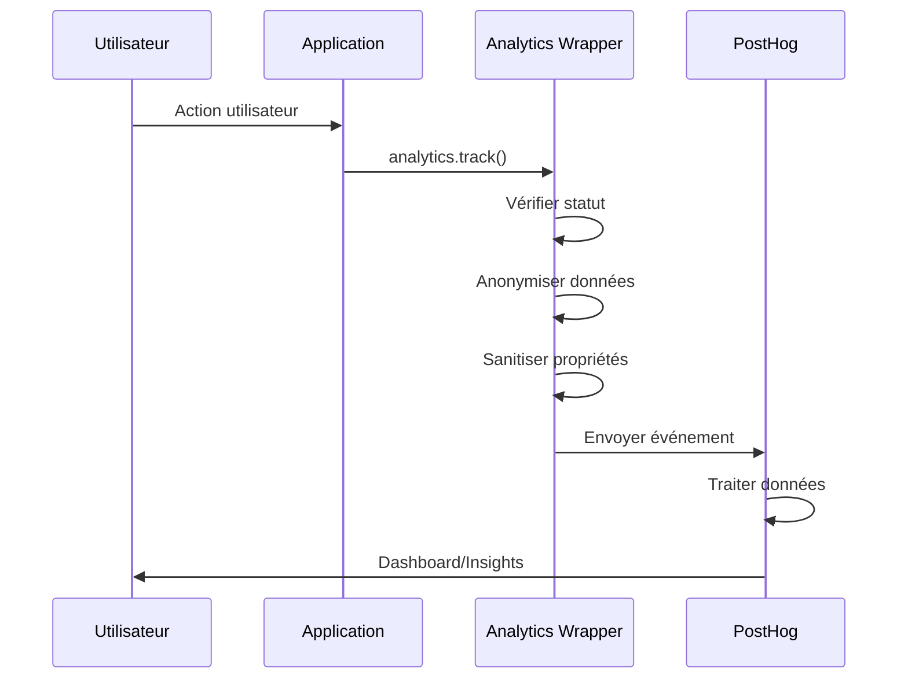
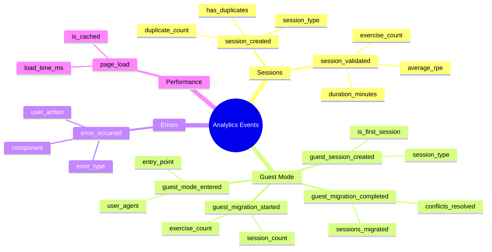
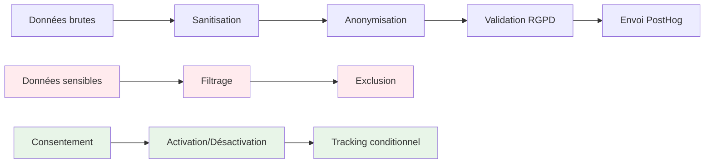
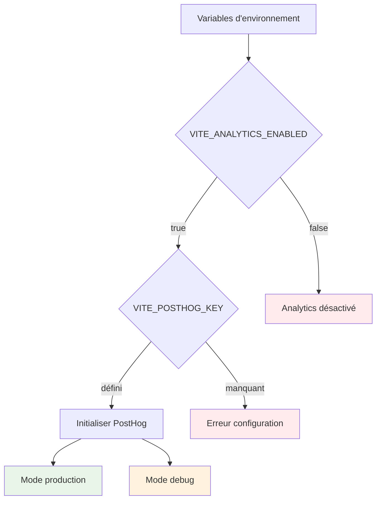

# Architecture Analytics PostHog

## Diagramme d'architecture

```mermaid
graph TB
    subgraph "Application Revia"
        A[Pages/Components] --> B[Analytics Wrapper]
        C[Guest Store] --> B
        D[Session Service] --> B
        E[Migration Service] --> B
        F[Validation Hooks] --> B
    end
    
    subgraph "Configuration"
        G[Variables d'environnement]
        H[PostHog Config]
        I[RGPD Settings]
    end
    
    subgraph "Sécurité"
        J[Anonymisation]
        K[Sanitisation]
        L[Consentement]
    end
    
    subgraph "PostHog Cloud"
        M[Event Collection]
        N[Data Processing]
        O[Dashboard]
        P[Insights]
    end
    
    B --> G
    B --> H
    B --> I
    B --> J
    B --> K
    B --> L
    B --> M
    M --> N
    N --> O
    N --> P
    
    style B fill:#e1f5fe
    style G fill:#f3e5f5
    style J fill:#e8f5e8
    style M fill:#fff3e0
```

## Flux de données

```mermaid
sequenceDiagram
    participant U as Utilisateur
    participant A as Application
    participant W as Analytics Wrapper
    participant P as PostHog
    
    U->>A: Action utilisateur
    A->>W: analytics.track()
    W->>W: Vérifier statut
    W->>W: Anonymiser données
    W->>W: Sanitiser propriétés
    W->>P: Envoyer événement
    P->>P: Traiter données
    P->>U: Dashboard/Insights
```

## Types d'événements

```mermaid
mindmap
  root((Analytics Events))
    Sessions
      session_created
        session_type
        has_duplicates
        duplicate_count
      session_validated
        exercise_count
        duration_minutes
        average_rpe
    Guest Mode
      guest_mode_entered
        entry_point
        user_agent
      guest_session_created
        session_type
        is_first_session
      guest_migration_started
        session_count
        exercise_count
      guest_migration_completed
        sessions_migrated
        conflicts_resolved
    Errors
      error_occurred
        error_type
        component
        user_action
    Performance
      page_load
        load_time_ms
        is_cached
```

## Sécurité et confidentialité

```mermaid
graph LR
    A[Données brutes] --> B[Sanitisation]
    B --> C[Anonymisation]
    C --> D[Validation RGPD]
    D --> E[Envoi PostHog]
    
    F[Données sensibles] --> G[Filtrage]
    G --> H[Exclusion]
    
    I[Consentement] --> J[Activation/Désactivation]
    J --> K[Tracking conditionnel]
    
    style F fill:#ffebee
    style G fill:#ffebee
    style H fill:#ffebee
    style I fill:#e8f5e8
    style J fill:#e8f5e8
    style K fill:#e8f5e8
```

## Configuration par environnement

```mermaid
graph TD
    A[Variables d'environnement] --> B{VITE_ANALYTICS_ENABLED}
    B -->|true| C{VITE_POSTHOG_KEY}
    B -->|false| D[Analytics désactivé]
    C -->|défini| E[Initialiser PostHog]
    C -->|manquant| F[Erreur configuration]
    E --> G[Mode production]
    E --> H[Mode debug]
    
    style D fill:#ffebee
    style F fill:#ffebee
    style G fill:#e8f5e8
    style H fill:#fff3e0
```
