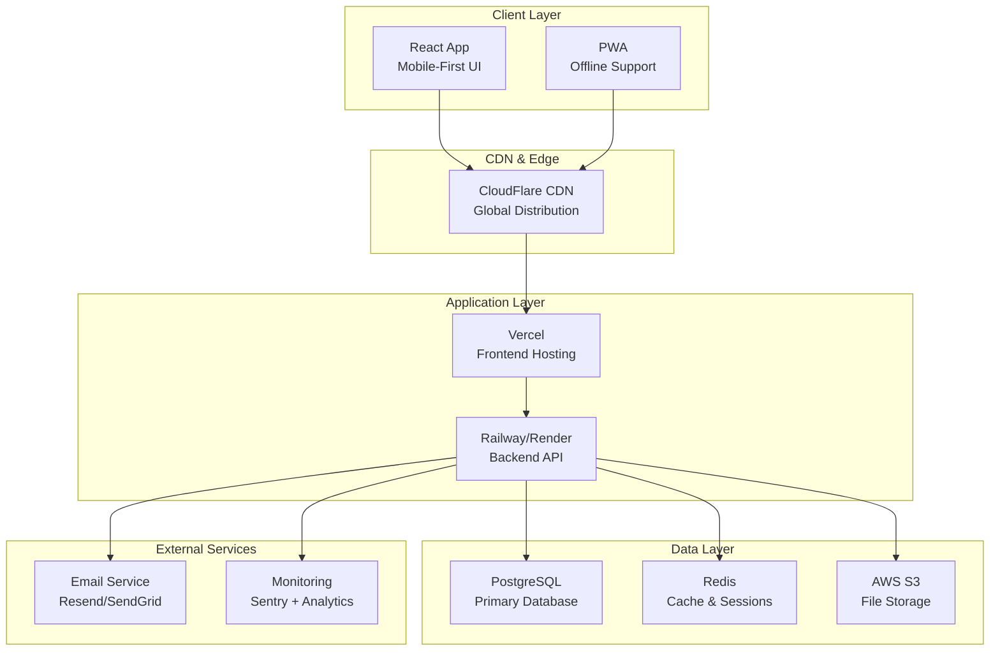
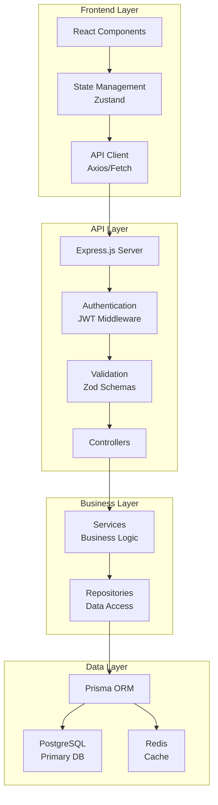
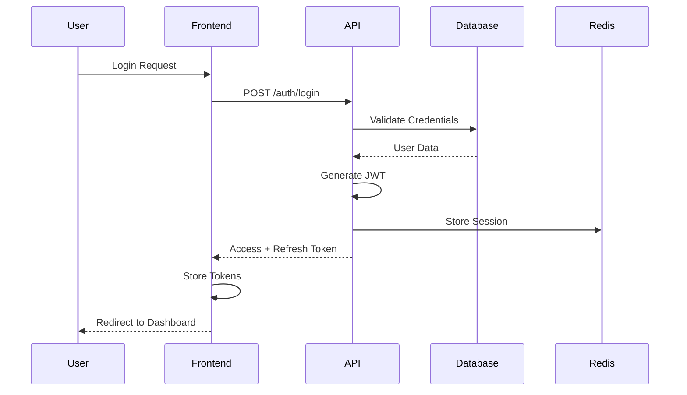
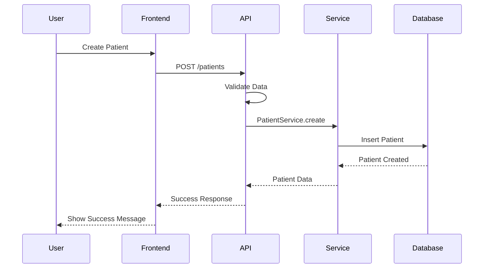
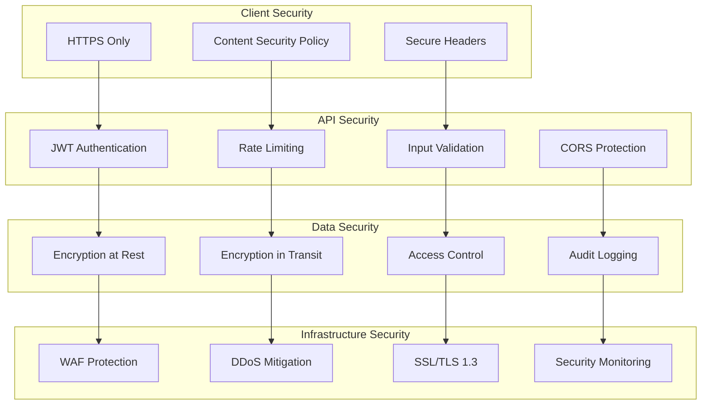
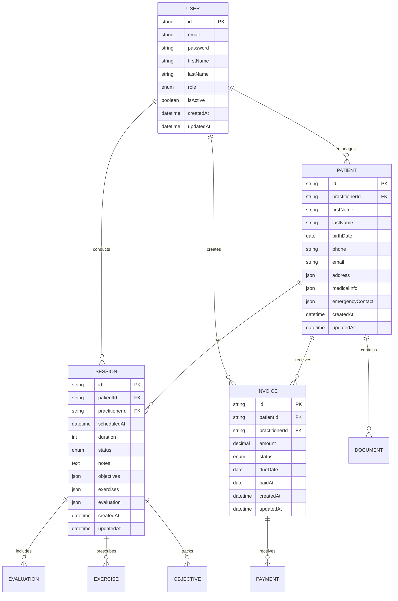
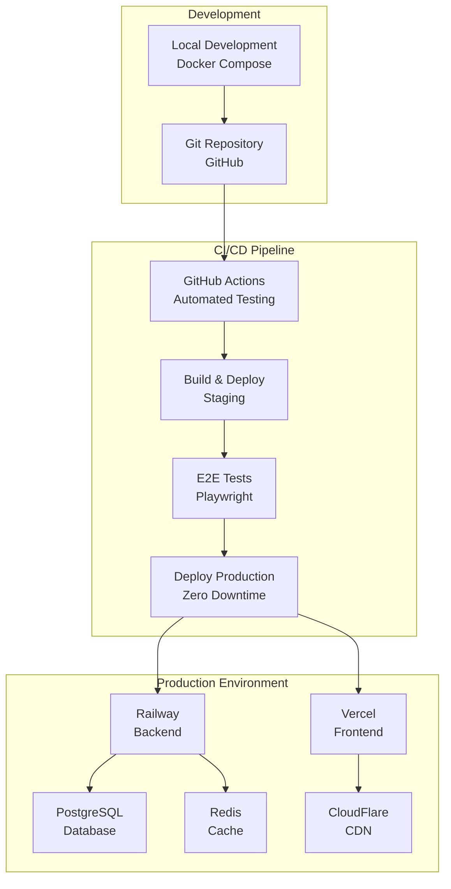
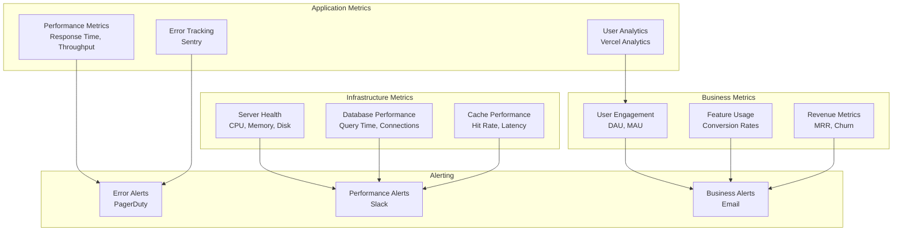
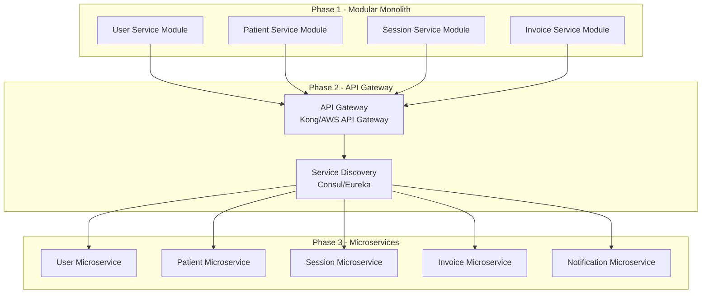
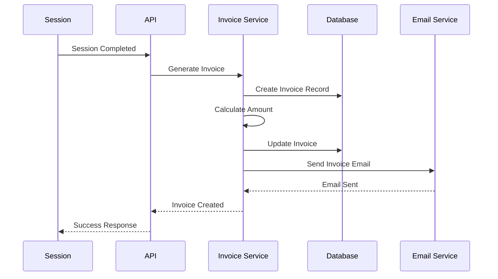

# Diagrammes d'Architecture - App-Kine

## 1. Architecture Globale

## 2. Architecture des Couches

## 3. Flux de Données - Authentification

## 4. Flux de Données - Gestion des Patients

## 5. Architecture de Sécurité

## 6. Modèle de Données - Relations

## 7. Architecture de Déploiement

## 8. Monitoring et Observabilité

## 9. Évolutivité - Migration vers Microservices

## 10. Flux de Facturation

---

**Architecte** : Winston (BMad-Method)  
**Date** : 2024-12-19  
**Version** : 1.0
