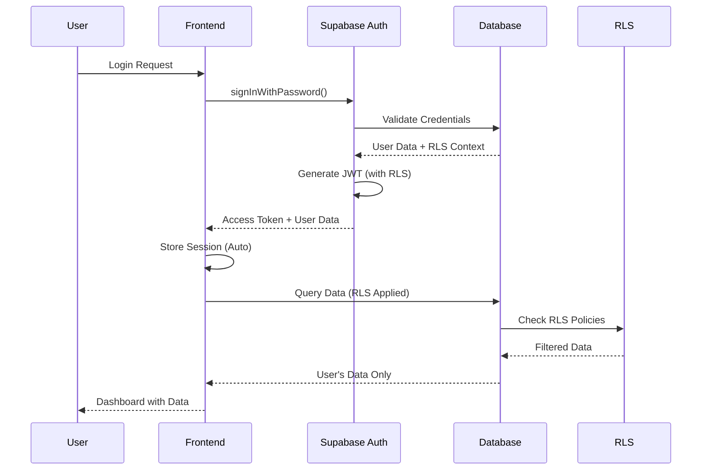
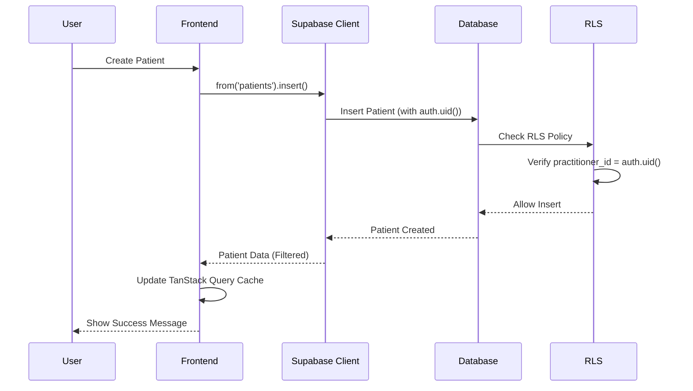
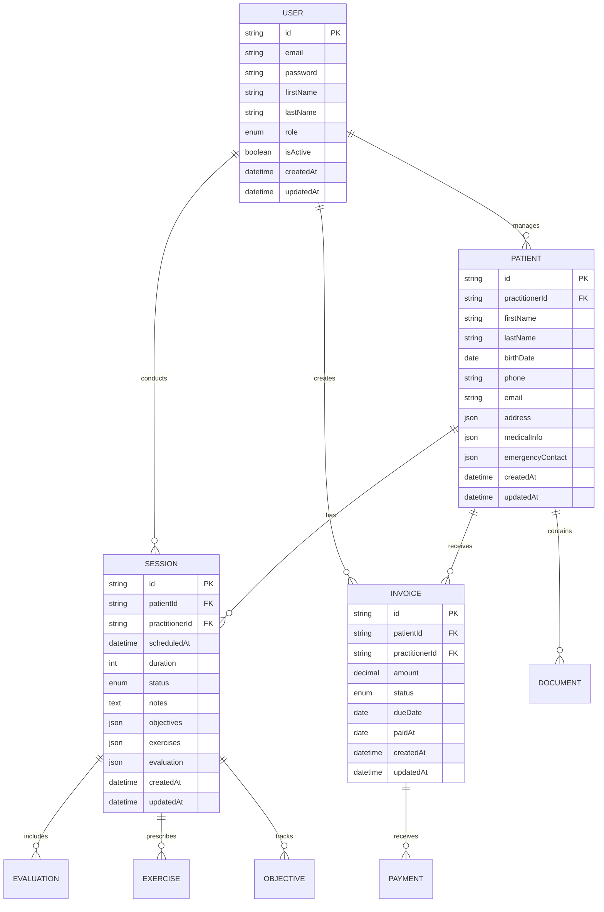
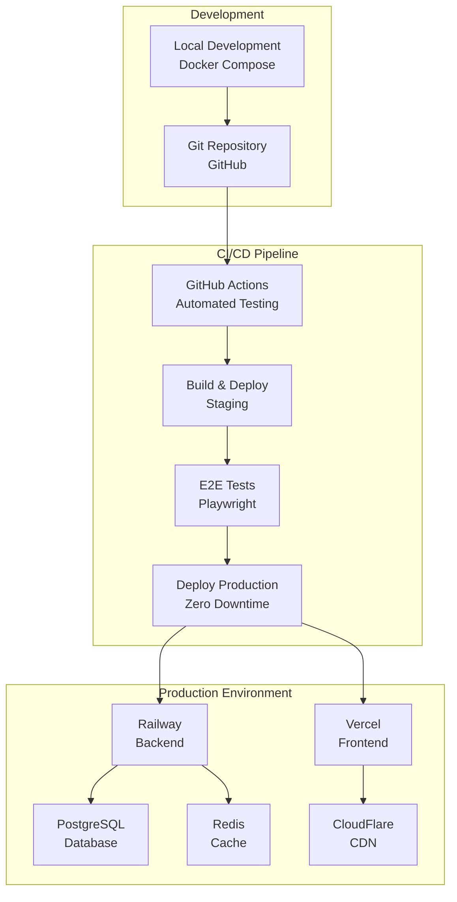
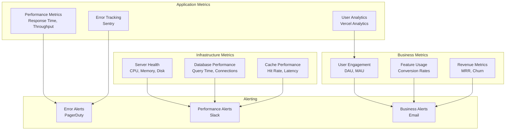
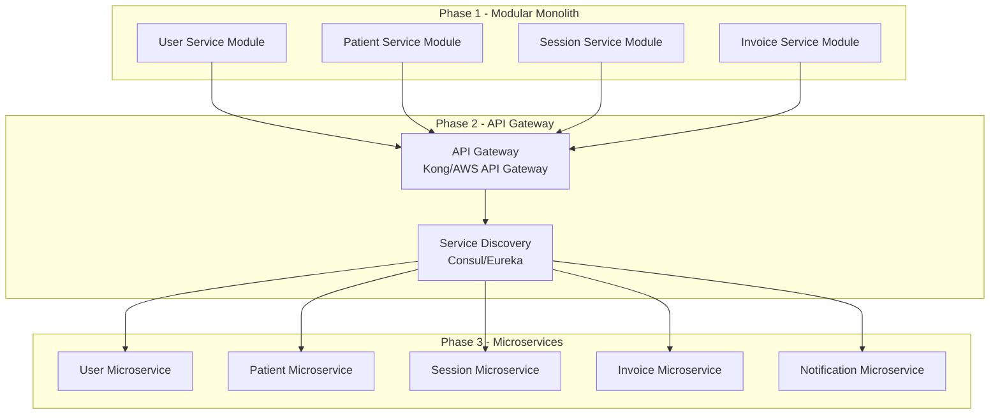
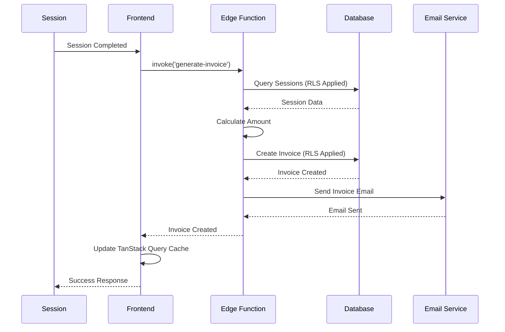
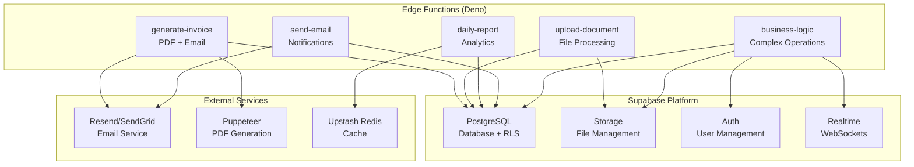

# Diagrammes d'Architecture - App-Kine

## 1. Architecture Globale (Serverless)

```mermaid
graph TB
    subgraph "Client Layer"
        A[React 19 App<br/>Mobile-First UI + PWA]
        B[TanStack Query<br/>Server State Management]
    end

    subgraph "CDN & Edge"
        C[CloudFlare CDN<br/>Global Distribution]
        D[Vercel Edge Network<br/>Global Edge Functions]
    end

    subgraph "Application Layer"
        E[Vercel<br/>Frontend Hosting]
        F[Supabase Platform<br/>Backend-as-a-Service]
    end

    subgraph "Data Layer"
        G[PostgreSQL<br/>Primary Database + RLS]
        H[Supabase Storage<br/>File Storage + RLS]
        I[Upstash Redis<br/>Cache (Optional)]
    end

    subgraph "Edge Functions"
        J[Generate Invoice<br/>PDF + Email]
        K[Upload Document<br/>File Processing]
        L[Daily Report<br/>Analytics]
    end

    subgraph "External Services"
        M[Email Service<br/>Resend/SendGrid]
        N[Monitoring<br/>Sentry + Analytics]
    end

    A --> C
    B --> C
    C --> D
    D --> E
    E --> F
    F --> G
    F --> H
    F --> I
    F --> J
    F --> K
    F --> L
    J --> M
    K --> N
    L --> N
```

## 2. Architecture des Couches (Serverless)

```mermaid
graph TB
    subgraph "Frontend Layer"
        A[React 19 Components]
        B[TanStack Query<br/>Server State]
        C[Zustand<br/>Client State]
        D[Supabase Client<br/>API Client]
    end

    subgraph "Edge Functions Layer"
        E[Generate Invoice<br/>PDF + Email]
        F[Upload Document<br/>File Processing]
        G[Daily Report<br/>Analytics]
        H[Business Logic<br/>Complex Operations]
    end

    subgraph "Data Access Layer"
        I[Supabase API<br/>REST + Realtime]
        J[Row Level Security<br/>RLS Policies]
        K[Supabase Storage<br/>File Management]
    end

    subgraph "Data Layer"
        L[PostgreSQL<br/>Primary DB + RLS]
        M[Upstash Redis<br/>Cache (Optional)]
        N[Audit Logs<br/>Security Tracking]
    end

    A --> B
    B --> C
    C --> D
    D --> I
    I --> J
    J --> L
    D --> E
    D --> F
    D --> G
    D --> H
    E --> I
    F --> K
    G --> I
    H --> I
    I --> M
    I --> N
```

## 3. Flux de Données - Authentification (Supabase)



## 4. Flux de Données - Gestion des Patients (RLS)



## 5. Architecture de Sécurité (RGPD-Native)

```mermaid
graph TB
    subgraph "Client Security"
        A[HTTPS Only (Vercel)]
        B[Content Security Policy]
        C[Secure Headers (Auto)]
    end

    subgraph "API Security"
        D[Supabase Auth (JWT)]
        E[Rate Limiting (CloudFlare)]
        F[Input Validation (Zod)]
        G[CORS Protection (Supabase)]
    end

    subgraph "Data Security (RLS)"
        H[Encryption at Rest (Auto)]
        I[Encryption in Transit (TLS 1.3)]
        J[Row Level Security (RLS)]
        K[Audit Logging (Auto)]
    end

    subgraph "Infrastructure Security"
        L[WAF Protection (CloudFlare)]
        M[DDoS Mitigation (Auto)]
        N[SSL/TLS 1.3 (Auto)]
        O[Security Monitoring (Sentry)]
    end

    subgraph "RGPD Compliance"
        P[Data Isolation (RLS)]
        Q[Right to Erasure (Cascade)]
        R[Data Portability (Export)]
        S[Consent Management (Auth)]
    end

    A --> D
    B --> E
    C --> F
    D --> H
    E --> I
    F --> J
    G --> K
    H --> L
    I --> M
    J --> N
    K --> O
    J --> P
    P --> Q
    Q --> R
    R --> S
```

## 6. Modèle de Données - Relations



## 7. Architecture de Déploiement



## 8. Monitoring et Observabilité



## 9. Évolutivité - Migration vers Microservices



## 10. Flux de Facturation (Edge Functions)



## 11. Architecture Edge Functions



---

**Architecte** : Winston (BMad-Method)  
**Date** : 2024-12-19  
**Version** : 2.0 (Serverless)
