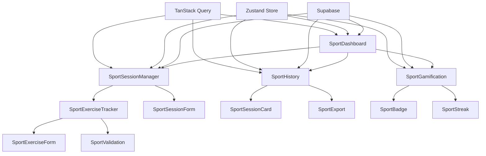

# Revia Sport MVP - Architecture v1.2

## Introduction

Ce document décrit l'architecture pour la transformation de l'application Revia d'un outil de gestion de cabinet vers une application sport-first pour les sportifs et patients autonomes. Cette transformation conserve l'architecture serverless Supabase existante tout en refocalisant complètement l'expérience utilisateur et les fonctionnalités métier.

**Relationship to Existing Architecture:**
Ce document complète l'architecture existante en définissant comment les nouveaux composants sport s'intègrent avec les systèmes actuels. Les conflits entre nouveaux et anciens patterns sont résolus en maintenant la cohérence tout en implémentant les améliorations.

### Existing Project Analysis

**Current Project State:**
- **Primary Purpose:** Application de gestion de cabinet de kinésithérapie avec gestion des patients, séances et facturation
- **Current Tech Stack:** React 19 + Vite + TypeScript + Tailwind + Zustand + TanStack Query + Supabase
- **Architecture Style:** Serverless "Full Supabase + Edge Functions" avec architecture modulaire
- **Deployment Method:** Vercel (Frontend) + Supabase (Backend)

**Available Documentation:**
- Architecture technique existante (docs/architecture-technique.md)
- PRD v1.0 et v1.1 avec spécifications détaillées
- Spécifications techniques complètes
- Standards de développement définis
- Types TypeScript et modèles de données Supabase

**Identified Constraints:**
- Architecture Supabase existante à préserver
- RLS (Row Level Security) déjà implémenté
- Structure de base de données cabinet existante
- Système d'authentification Supabase en place
- Déploiement Vercel + Supabase opérationnel

### Change Log

| Change | Date | Version | Description | Author |
|--------|------|---------|-------------|--------|
| Création | 2025-01-14 | 1.0 | Architecture Sport MVP | BMad Orchestrator |

## Enhancement Scope and Integration Strategy

### Enhancement Overview

**Enhancement Type:** Major Feature Modification + UI/UX Overhaul
**Scope:** Transformation complète de l'expérience utilisateur de cabinet vers sport-first
**Integration Impact:** Major Impact (architectural changes required)

### Integration Approach

**Code Integration Strategy:** 
- Réutilisation des composants UI existants (Radix UI + Tailwind)
- Extension des stores Zustand existants pour les fonctionnalités sport
- Conservation de la structure de routage React Router
- Ajout de nouveaux composants sport dans `src/components/features/`

**Database Integration:** 
- Ajout de nouvelles tables pour les fonctionnalités sport
- Conservation des tables existantes pour compatibilité future
- Extension du système RLS existant pour les nouvelles entités
- Migration progressive des données

**API Integration:** 
- Extension des Edge Functions Supabase existantes
- Nouveaux endpoints pour les fonctionnalités sport
- Conservation de l'authentification Supabase existante
- Intégration avec les services existants

**UI Integration:** 
- Refactoring de la navigation vers mobile-first
- Conservation du système de design existant
- Nouveaux écrans sport avec barre d'onglets
- Mode Guest sans authentification

### Compatibility Requirements

- **Existing API Compatibility:** Conservation de tous les endpoints existants
- **Database Schema Compatibility:** Ajout de tables sans modification des existantes
- **UI/UX Consistency:** Maintien de la cohérence visuelle avec Radix UI + Tailwind
- **Performance Impact:** Bundle < 300KB, TTFB < 1s maintenus

## Tech Stack

### Existing Technology Stack

| Category | Current Technology | Version | Usage in Enhancement | Notes |
|----------|-------------------|---------|---------------------|-------|
| Frontend Framework | React | 19 | Core framework | Conservation |
| Build Tool | Vite | 7.x | Build system | Conservation |
| Language | TypeScript | Latest | Type safety | Conservation |
| Styling | Tailwind CSS | Latest | UI styling | Conservation |
| UI Components | Radix UI | Latest | Component library | Conservation |
| State Management | Zustand | Latest | Client state | Extension |
| Server State | TanStack Query | v5 | Server state | Conservation |
| Routing | React Router | v6 | Navigation | Refactoring |
| Forms | React Hook Form + Zod | Latest | Form handling | Conservation |
| Backend Platform | Supabase | Latest | Backend services | Extension |
| Database | PostgreSQL | 15+ | Data storage | Extension |
| Authentication | Supabase Auth | Latest | User auth | Conservation |
| File Storage | Supabase Storage | Latest | File handling | Conservation |
| Deployment | Vercel | Latest | Frontend hosting | Conservation |

### New Technology Additions

| Technology | Version | Purpose | Rationale | Integration Method |
|------------|---------|---------|-----------|-------------------|
| Aucune nouvelle technologie | - | - | Conservation de l'architecture existante | - |

## Data Models and Schema Changes

### New Data Models

#### SportUser
**Purpose:** Profil utilisateur sportif simplifié avec objectifs et préférences
**Integration:** Extension de la table users existante avec nouveaux champs

**Key Attributes:**
- id: UUID - Identifiant unique (hérité de users)
- display_name: VARCHAR(100) - Nom d'affichage/pseudo
- sport_goals: TEXT - Objectifs sportifs (texte libre)
- preferences: JSONB - Préférences utilisateur (notifications, thème, etc.)
- streak_count: INTEGER - Nombre de jours consécutifs
- total_sessions: INTEGER - Nombre total de séances
- guest_data_migrated: BOOLEAN - Indique si les données Guest ont été migrées
- data_retention_consent: BOOLEAN - Consentement RGPD pour la rétention des données
- created_at: TIMESTAMP - Date de création
- updated_at: TIMESTAMP - Date de modification

**Relationships:**
- **With Existing:** Hérite de users (auth.users)
- **With New:** One-to-many avec SportSession

#### SportSession
**Purpose:** Séances d'entraînement sportif avec exercices et validation
**Integration:** Nouvelle table indépendante liée à SportUser

**Key Attributes:**
- id: UUID - Identifiant unique
- user_id: UUID - Référence vers SportUser
- name: VARCHAR(200) - Nom de la séance
- date: DATE - Date de la séance
- type: VARCHAR(50) - Type de séance (cardio, musculation, etc.)
- status: VARCHAR(20) - Statut (draft, in_progress, completed)
- objectives: TEXT - Objectifs de la séance
- notes: TEXT - Notes utilisateur
- rpe_score: INTEGER - Score RPE (1-10)
- pain_level: INTEGER - Niveau de douleur (1-10)
- duration_minutes: INTEGER - Durée en minutes
- created_at: TIMESTAMP - Date de création
- updated_at: TIMESTAMP - Date de modification

**Relationships:**
- **With Existing:** Aucune
- **With New:** Many-to-one avec SportUser, One-to-many avec SportExercise

#### SportExercise
**Purpose:** Exercices individuels dans une séance sportive
**Integration:** Nouvelle table liée à SportSession

**Key Attributes:**
- id: UUID - Identifiant unique
- session_id: UUID - Référence vers SportSession
- name: VARCHAR(200) - Nom de l'exercice
- exercise_type: VARCHAR(50) - Type d'exercice
- sets: INTEGER - Nombre de séries
- reps: INTEGER - Nombre de répétitions
- weight_kg: DECIMAL - Poids en kg
- duration_seconds: INTEGER - Durée en secondes
- rest_seconds: INTEGER - Temps de repos
- order_index: INTEGER - Ordre dans la séance
- notes: TEXT - Notes spécifiques
- created_at: TIMESTAMP - Date de création
- updated_at: TIMESTAMP - Date de modification

**Relationships:**
- **With Existing:** Aucune
- **With New:** Many-to-one avec SportSession

#### GuestData
**Purpose:** Données temporaires des utilisateurs Guest avec expiration automatique
**Integration:** Table temporaire pour le mode Guest avec chiffrement local

**Key Attributes:**
- id: UUID - Identifiant unique temporaire
- guest_token: VARCHAR(255) - Token de session Guest
- encrypted_data: TEXT - Données chiffrées (sessions, exercices, etc.)
- expires_at: TIMESTAMP - Date d'expiration (30 jours)
- migration_consent: BOOLEAN - Consentement pour migration vers compte permanent
- created_at: TIMESTAMP - Date de création
- updated_at: TIMESTAMP - Date de modification

**Relationships:**
- **With Existing:** Aucune
- **With New:** One-to-one avec SportUser (après migration)

#### SportBadge
**Purpose:** Système de gamification avec badges et récompenses
**Integration:** Nouvelle table pour la gamification

**Key Attributes:**
- id: UUID - Identifiant unique
- user_id: UUID - Référence vers SportUser
- badge_type: VARCHAR(50) - Type de badge
- badge_name: VARCHAR(100) - Nom du badge
- description: TEXT - Description du badge
- earned_at: TIMESTAMP - Date d'obtention
- created_at: TIMESTAMP - Date de création

**Relationships:**
- **With Existing:** Aucune
- **With New:** Many-to-one avec SportUser

### Schema Integration Strategy

**Database Changes Required:**
- **New Tables:** sport_users, sport_sessions, sport_exercises, sport_badges, guest_data
- **Modified Tables:** Aucune modification des tables existantes
- **New Indexes:** Index sur user_id, date, type, expires_at pour les performances
- **Migration Strategy:** Création progressive des nouvelles tables sans impact sur l'existant
- **Security:** RLS activé sur toutes les nouvelles tables, chiffrement des données Guest

**Backward Compatibility:**
- Conservation de toutes les tables existantes
- Aucune modification des schémas existants
- RLS maintenu sur toutes les tables
- API existante préservée

## Component Architecture

### New Components

#### SportDashboard
**Responsibility:** Tableau de bord principal sportif avec statistiques et prochaines séances
**Integration Points:** 
- Utilise SportUser store pour les données utilisateur
- Intègre avec TanStack Query pour les statistiques
- Navigation vers les autres écrans sport

**Key Interfaces:**
- useSportUser() - Hook pour les données utilisateur
- useSportStats() - Hook pour les statistiques
- Navigation vers SportSessionList, SportSessionCreate

**Dependencies:**
- **Existing Components:** Layout, Navigation, UI Components
- **New Components:** SportStats, SportSessionPreview

**Technology Stack:** React + TypeScript + Tailwind + Radix UI

#### SportSessionManager
**Responsibility:** Gestion complète des séances (création, duplication, validation)
**Integration Points:**
- Intègre avec Supabase pour la persistance
- Utilise React Hook Form pour les formulaires
- Calendrier pour la sélection de dates

**Key Interfaces:**
- useSportSessions() - Hook pour les séances
- useSportSessionForm() - Hook pour les formulaires
- Duplication de séances sur dates multiples

**Dependencies:**
- **Existing Components:** Form components, Calendar
- **New Components:** SportExerciseList, SportSessionForm

**Technology Stack:** React + TypeScript + React Hook Form + Zod

#### SportExerciseTracker
**Responsibility:** Enregistrement des exercices avec RPE, douleur et notes
**Integration Points:**
- Intègre avec SportSession pour la persistance
- Validation des données avec Zod
- Interface mobile-first

**Key Interfaces:**
- useSportExercises() - Hook pour les exercices
- RPE et douleur scales
- Validation en temps réel

**Dependencies:**
- **Existing Components:** Form components, UI components
- **New Components:** SportExerciseForm, SportValidation

**Technology Stack:** React + TypeScript + React Hook Form + Zod

#### SportHistory
**Responsibility:** Historique chronologique des séances avec filtres et statistiques
**Integration Points:**
- Intègre avec Supabase pour les données
- Filtres par période et type
- Export CSV/PDF

**Key Interfaces:**
- useSportHistory() - Hook pour l'historique
- Filtres de recherche
- Export des données

**Dependencies:**
- **Existing Components:** Data tables, Filters
- **New Components:** SportSessionCard, SportExport

**Technology Stack:** React + TypeScript + TanStack Query

#### SportGamification
**Responsibility:** Système de gamification avec streaks, badges et motivation
**Integration Points:**
- Intègre avec SportUser pour les statistiques
- Calcul automatique des streaks
- Attribution des badges

**Key Interfaces:**
- useSportGamification() - Hook pour la gamification
- Badge system
- Streak calculation

**Dependencies:**
- **Existing Components:** UI components
- **New Components:** SportBadge, SportStreak

**Technology Stack:** React + TypeScript + Zustand

### Component Interaction Diagram



## API Design and Integration

### API Integration Strategy

**API Integration Strategy:** Extension des Edge Functions Supabase existantes avec nouvelles fonctions sport
**Authentication:** Conservation de Supabase Auth existant
**Versioning:** Pas de versioning nécessaire (nouvelles fonctions)

### New API Endpoints

#### Sport User Management

- **Method:** GET
- **Endpoint:** /api/sport/user/profile
- **Purpose:** Récupérer le profil sportif de l'utilisateur
- **Integration:** Utilise l'authentification Supabase existante

```json
{
  "id": "uuid",
  "display_name": "string",
  "sport_goals": "string",
  "preferences": {},
  "streak_count": 0,
  "total_sessions": 0
}
```

- **Method:** PUT
- **Endpoint:** /api/sport/user/profile
- **Purpose:** Mettre à jour le profil sportif
- **Integration:** Validation avec Zod, persistance Supabase

#### Sport Sessions

- **Method:** GET
- **Endpoint:** /api/sport/sessions
- **Purpose:** Récupérer les séances sportives avec filtres
- **Integration:** RLS Supabase, pagination

- **Method:** POST
- **Endpoint:** /api/sport/sessions
- **Purpose:** Créer une nouvelle séance sportive
- **Integration:** Validation Zod, création en base

- **Method:** POST
- **Endpoint:** /api/sport/sessions/duplicate
- **Purpose:** Dupliquer une séance sur dates multiples
- **Integration:** Logique de duplication, création multiple

#### Sport Exercises

- **Method:** GET
- **Endpoint:** /api/sport/sessions/{id}/exercises
- **Purpose:** Récupérer les exercices d'une séance
- **Integration:** RLS Supabase, tri par order_index

- **Method:** POST
- **Endpoint:** /api/sport/sessions/{id}/exercises
- **Purpose:** Ajouter un exercice à une séance
- **Integration:** Validation Zod, création en base

#### Sport Statistics

- **Method:** GET
- **Endpoint:** /api/sport/stats
- **Purpose:** Récupérer les statistiques sportives
- **Integration:** Calculs en base, agrégations

## Source Tree

### Existing Project Structure

```
src/
├── components/
│   ├── ui/                 # Composants UI de base (Radix UI)
│   ├── forms/              # Composants de formulaires
│   ├── features/           # Composants métier existants
│   ├── layouts/            # Layouts de pages
│   └── navigation/         # Navigation existante
├── pages/                  # Pages existantes
├── hooks/                  # Hooks React personnalisés
├── stores/                 # Stores Zustand existants
├── services/               # Services API existants
├── types/                  # Types TypeScript existants
├── lib/                    # Utilitaires et configuration
└── utils/                  # Fonctions utilitaires
```

### New File Organization

```
src/
├── components/
│   ├── ui/                 # Composants UI de base (Radix UI) - Existing
│   ├── forms/              # Composants de formulaires - Existing
│   ├── features/           # Composants métier existants + nouveaux
│   │   ├── SportDashboard.tsx      # Nouveau - Dashboard sportif
│   │   ├── SportSessionManager.tsx # Nouveau - Gestion des séances
│   │   ├── SportExerciseTracker.tsx # Nouveau - Suivi des exercices
│   │   ├── SportHistory.tsx        # Nouveau - Historique
│   │   ├── SportGamification.tsx   # Nouveau - Gamification
│   │   └── SportSessionForm.tsx    # Nouveau - Formulaire séance
│   ├── layouts/            # Layouts de pages - Existing
│   └── navigation/         # Navigation existante - Existing
├── pages/                  # Pages existantes + nouvelles
│   ├── SportHomePage.tsx   # Nouveau - Page d'accueil sport
│   └── SportSessionPage.tsx # Nouveau - Page de séance
├── hooks/                  # Hooks React personnalisés + nouveaux
│   ├── useSportUser.ts     # Nouveau - Hook utilisateur sport
│   ├── useSportSessions.ts # Nouveau - Hook séances
│   └── useSportStats.ts    # Nouveau - Hook statistiques
├── stores/                 # Stores Zustand existants + nouveaux
│   ├── sportStore.ts       # Nouveau - Store sport
│   └── gamificationStore.ts # Nouveau - Store gamification
├── services/               # Services API existants + nouveaux
│   ├── sportService.ts     # Nouveau - Service sport
│   └── gamificationService.ts # Nouveau - Service gamification
├── types/                  # Types TypeScript existants + nouveaux
│   ├── sport.ts            # Nouveau - Types sport
│   └── gamification.ts     # Nouveau - Types gamification
├── lib/                    # Utilitaires et configuration - Existing
└── utils/                  # Fonctions utilitaires - Existing
```

### Integration Guidelines

- **File Naming:** Conservation des conventions existantes (PascalCase pour composants, camelCase pour hooks)
- **Folder Organization:** Ajout dans les dossiers existants, nouveaux dossiers uniquement si nécessaire
- **Import/Export Patterns:** Conservation des patterns existants, imports relatifs

## Infrastructure and Deployment Integration

### Existing Infrastructure

**Current Deployment:** Vercel (Frontend) + Supabase (Backend)
**Infrastructure Tools:** Vercel CLI, Supabase CLI, GitHub Actions
**Environments:** Development, Production

### Enhancement Deployment Strategy

**Deployment Approach:** Déploiement progressif avec feature flags
**Infrastructure Changes:** Aucun changement d'infrastructure
**Pipeline Integration:** Extension du pipeline existant avec nouvelles migrations

### Rollback Strategy

**Rollback Method:** Feature flags + rollback Vercel + rollback Supabase migrations
**Risk Mitigation:** Tests de régression, déploiement progressif
**Monitoring:** Sentry existant + nouveaux métriques sport

## Coding Standards

### Existing Standards Compliance

**Code Style:** TypeScript strict, ESLint + Prettier
**Linting Rules:** Configuration existante maintenue
**Testing Patterns:** Vitest + Testing Library
**Documentation Style:** JSDoc pour les fonctions publiques

### Enhancement-Specific Standards

- **Sport Components:** Préfixe "Sport" pour tous les composants sport
- **Hook Naming:** useSport* pour tous les hooks sport
- **Service Naming:** *Service pour tous les services
- **Type Naming:** Interface* pour tous les types

### Critical Integration Rules

- **Existing API Compatibility:** Aucune modification des endpoints existants
- **Database Integration:** Nouvelles tables uniquement, pas de modification des existantes
- **Error Handling:** Conservation des patterns existants
- **Logging Consistency:** Utilisation des patterns de logging existants

## Testing Strategy

### Integration with Existing Tests

**Existing Test Framework:** Vitest + Testing Library
**Test Organization:** Tests unitaires dans __tests__, tests E2E avec Playwright
**Coverage Requirements:** >80% pour les nouveaux composants

### New Testing Requirements

#### Unit Tests for New Components

- **Framework:** Vitest + Testing Library
- **Location:** src/__tests__/sport/
- **Coverage Target:** >80%
- **Integration with Existing:** Utilisation des mocks existants

#### Integration Tests

- **Scope:** Intégration Supabase + composants sport
- **Existing System Verification:** Tests de régression sur les fonctionnalités existantes
- **New Feature Testing:** Tests complets des nouvelles fonctionnalités

#### Regression Testing

- **Existing Feature Verification:** Tests automatisés sur toutes les fonctionnalités existantes
- **Automated Regression Suite:** Intégration dans le pipeline CI/CD
- **Manual Testing Requirements:** Tests manuels sur les parcours critiques

## Security Integration

### Existing Security Measures

**Authentication:** Supabase Auth avec JWT
**Authorization:** Row Level Security (RLS) sur toutes les tables
**Data Protection:** Chiffrement en transit et au repos
**Security Tools:** Sentry pour le monitoring

### Enhancement Security Requirements

**New Security Measures:** RLS sur les nouvelles tables sport
**Integration Points:** Conservation de l'authentification existante
**Compliance Requirements:** RGPD maintenu, data minimization

### Security Testing

**Existing Security Tests:** Tests d'authentification existants
**New Security Test Requirements:** Tests RLS sur les nouvelles tables
**Penetration Testing:** Tests de sécurité sur les nouveaux endpoints

## Next Steps

### Story Manager Handoff

**Référence:** Ce document d'architecture pour la transformation sport-first
**Exigences d'intégration validées:** 
- Conservation de l'architecture Supabase existante
- Ajout de nouvelles tables sans modification des existantes
- RLS maintenu sur toutes les nouvelles entités
- Navigation mobile-first avec barre d'onglets

**Contraintes du système existant basées sur l'analyse réelle:**
- Structure de base de données cabinet préservée
- API existante maintenue
- Composants UI existants réutilisés
- Déploiement Vercel + Supabase conservé

**Première histoire à implémenter:** Refactoring Architecture et Navigation
**Points de contrôle d'intégration clairs:**
- Vérification que les fonctionnalités existantes restent accessibles
- Tests de régression sur la navigation
- Validation des performances

**Emphase sur le maintien de l'intégrité du système existant:** Chaque story doit inclure des vérifications que les fonctionnalités existantes continuent de fonctionner.

### Developer Handoff

**Référence:** Ce document d'architecture et les standards de codage existants analysés
**Exigences d'intégration avec le codebase existant validées:**
- Réutilisation des composants Radix UI + Tailwind existants
- Extension des stores Zustand existants
- Conservation des patterns de routage React Router
- Intégration avec TanStack Query existant

**Décisions techniques clés basées sur les contraintes réelles du projet:**
- Architecture Supabase serverless maintenue
- RLS existant étendu aux nouvelles tables
- Aucune modification des tables existantes
- Feature flags pour basculer entre modes

**Exigences de compatibilité du système existant avec étapes de vérification spécifiques:**
- Tests de régression sur toutes les fonctionnalités existantes
- Validation des performances (bundle < 300KB, TTFB < 1s)
- Vérification de l'authentification Supabase
- Tests de l'interface utilisateur existante

**Séquençage clair de l'implémentation pour minimiser les risques:**
1. Refactoring navigation (risque minimal)
2. Nouveaux composants sport (isolation)
3. Intégration base de données (migrations progressives)
4. Tests de régression complets
5. Déploiement progressif avec feature flags
