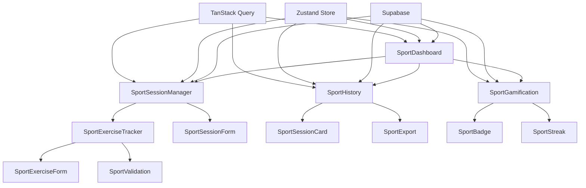

# Architecture Sport MVP - Architecture des Composants

## Component Architecture

### New Components

#### SportDashboard

**Responsibility:** Tableau de bord principal sportif avec statistiques et prochaines séances
**Integration Points:**

- Utilise SportUser store pour les données utilisateur
- Intègre avec TanStack Query pour les statistiques
- Navigation vers les autres écrans sport

**Key Interfaces:**

- useSportUser() - Hook pour les données utilisateur
- useSportStats() - Hook pour les statistiques
- Navigation vers SportSessionList, SportSessionCreate

**Dependencies:**

- **Existing Components:** Layout, Navigation, UI Components
- **New Components:** SportStats, SportSessionPreview

**Technology Stack:** React + TypeScript + Tailwind + Radix UI

#### SportSessionManager

**Responsibility:** Gestion complète des séances (création, duplication, validation)
**Integration Points:**

- Intègre avec Supabase pour la persistance
- Utilise React Hook Form pour les formulaires
- Calendrier pour la sélection de dates

**Key Interfaces:**

- useSportSessions() - Hook pour les séances
- useSportSessionForm() - Hook pour les formulaires
- Duplication de séances sur dates multiples

**Dependencies:**

- **Existing Components:** Form components, Calendar
- **New Components:** SportExerciseList, SportSessionForm

**Technology Stack:** React + TypeScript + React Hook Form + Zod

#### SportExerciseTracker

**Responsibility:** Enregistrement des exercices avec RPE, douleur et notes
**Integration Points:**

- Intègre avec SportSession pour la persistance
- Validation des données avec Zod
- Interface mobile-first

**Key Interfaces:**

- useSportExercises() - Hook pour les exercices
- RPE et douleur scales
- Validation en temps réel

**Dependencies:**

- **Existing Components:** Form components, UI components
- **New Components:** SportExerciseForm, SportValidation

**Technology Stack:** React + TypeScript + React Hook Form + Zod

#### SportHistory

**Responsibility:** Historique chronologique des séances avec filtres et statistiques
**Integration Points:**

- Intègre avec Supabase pour les données
- Filtres par période et type
- Export CSV/PDF

**Key Interfaces:**

- useSportHistory() - Hook pour l'historique
- Filtres de recherche
- Export des données

**Dependencies:**

- **Existing Components:** Data tables, Filters
- **New Components:** SportSessionCard, SportExport

**Technology Stack:** React + TypeScript + TanStack Query

#### SportGamification

**Responsibility:** Système de gamification avec streaks, badges et motivation
**Integration Points:**

- Intègre avec SportUser pour les statistiques
- Calcul automatique des streaks
- Attribution des badges

**Key Interfaces:**

- useSportGamification() - Hook pour la gamification
- Badge system
- Streak calculation

**Dependencies:**

- **Existing Components:** UI components
- **New Components:** SportBadge, SportStreak

**Technology Stack:** React + TypeScript + Zustand

### Component Interaction Diagram



### Composants Spécialisés

#### StreakCounter

**Purpose:** Affichage des streaks avec progression visuelle
**Props:**

```typescript
interface StreakCounterProps {
  currentStreak: number;
  bestStreak: number;
  variant?: 'compact' | 'detailed';
  className?: string;
}
```

#### BadgeSystem

**Purpose:** Système de badges avec états (obtenu/verrouillé)
**Props:**

```typescript
interface BadgeProps {
  type: 'achievement' | 'milestone' | 'special';
  name: string;
  description: string;
  earned: boolean;
  progress?: number;
  maxProgress?: number;
  icon?: string;
}
```

#### RPEScale

**Purpose:** Échelles RPE et douleur interactives
**Props:**

```typescript
interface RPEScaleProps {
  value: number;
  onChange: (value: number) => void;
  label?: string;
  showLabels?: boolean;
  className?: string;
}
```

#### SessionCard

**Purpose:** Cartes de séances avec actions contextuelles
**Props:**

```typescript
interface SessionCardProps {
  session: SportSession;
  onStart: () => void;
  onEdit: () => void;
  onDuplicate: () => void;
  variant?: 'upcoming' | 'completed' | 'draft';
}
```

### Hooks Spécialisés

#### useSportUser

```typescript
function useSportUser() {
  return {
    user: SportUser | null;
    updateProfile: (data: Partial<SportUser>) => Promise<void>;
    isLoading: boolean;
    error: Error | null;
  };
}
```

#### useSportSessions

```typescript
function useSportSessions() {
  return {
    sessions: SportSession[];
    createSession: (data: CreateSessionInput) => Promise<SportSession>;
    updateSession: (id: string, data: UpdateSessionInput) => Promise<void>;
    duplicateSession: (id: string, dates: Date[]) => Promise<SportSession[]>;
    isLoading: boolean;
    error: Error | null;
  };
}
```

#### useSportStats

```typescript
function useSportStats() {
  return {
    stats: SportStats;
    streak: number;
    badges: Badge[];
    weeklyFrequency: number;
    totalDuration: number;
    isLoading: boolean;
  };
}
```

### Stores Zustand

#### SportStore

```typescript
interface SportStore {
  // État des séances
  sessions: SportSession[];
  currentSession: SportSession | null;

  // Actions
  setSessions: (sessions: SportSession[]) => void;
  setCurrentSession: (session: SportSession | null) => void;
  addSession: (session: SportSession) => void;
  updateSession: (id: string, updates: Partial<SportSession>) => void;

  // État de chargement
  isLoading: boolean;
  setLoading: (loading: boolean) => void;
}
```

#### GamificationStore

```typescript
interface GamificationStore {
  // Streaks et badges
  currentStreak: number;
  bestStreak: number;
  badges: Badge[];

  // Actions
  updateStreak: (streak: number) => void;
  addBadge: (badge: Badge) => void;
  checkBadges: (session: SportSession) => void;

  // Calculs
  calculateStreak: (sessions: SportSession[]) => number;
  checkNewBadges: (user: SportUser, sessions: SportSession[]) => Badge[];
}
```

### Integration avec Composants Existants

#### Réutilisation des Composants UI

- **Button** : Boutons d'action (Commencer, Modifier, Dupliquer)
- **Card** : Cartes de séances et statistiques
- **Dialog** : Modales de création et modification
- **Form** : Formulaires de séances et exercices
- **Input** : Champs de saisie
- **Select** : Sélection de type de séance

#### Extension des Layouts

- **Layout** : Extension pour supporter la navigation mobile
- **PageForm** : Adaptation pour les formulaires sport
- **PageFilters** : Filtres pour l'historique des séances

#### Intégration des Services

- **SupabaseService** : Extension pour les nouvelles tables
- **AuthService** : Conservation de l'authentification existante
- **StorageService** : Pour les exports et fichiers
